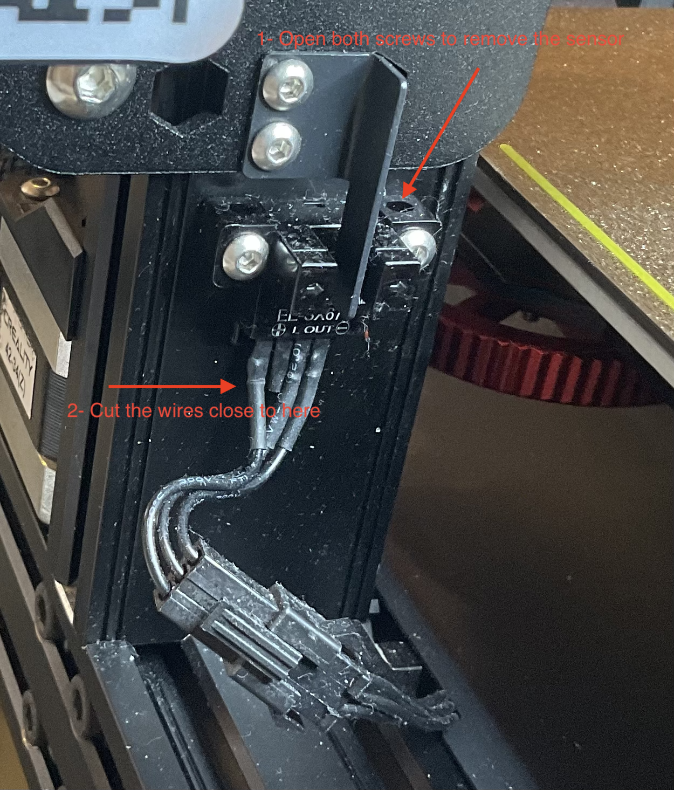
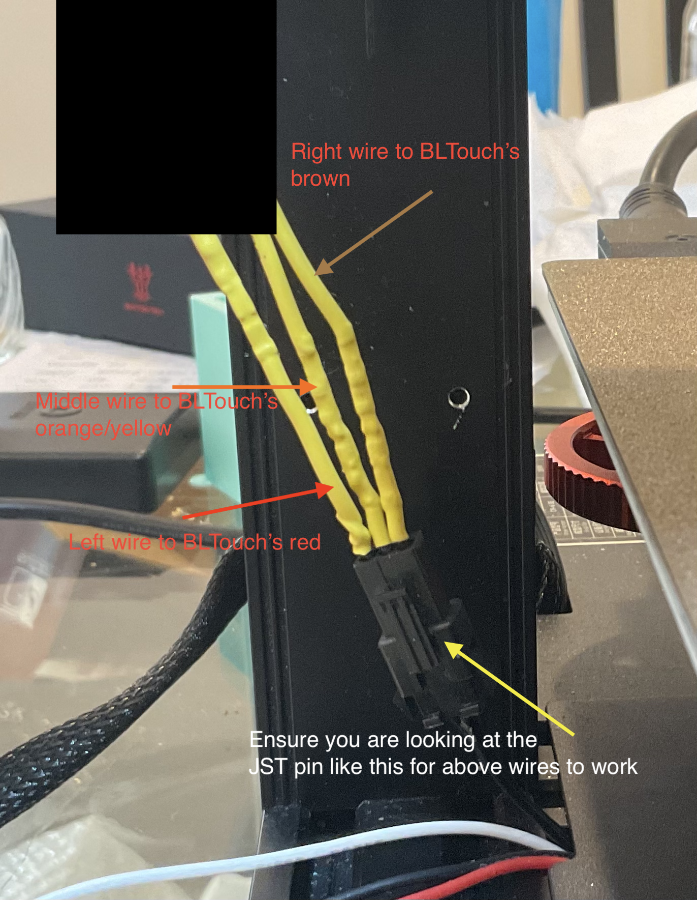
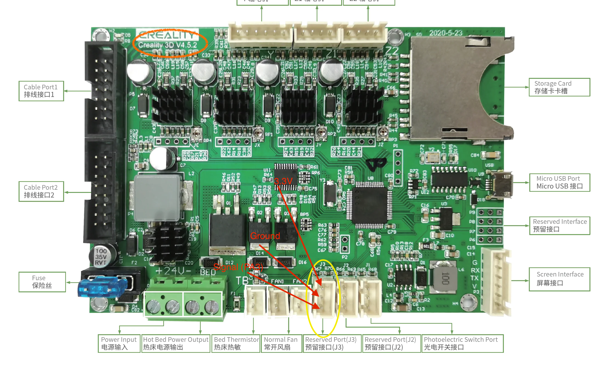
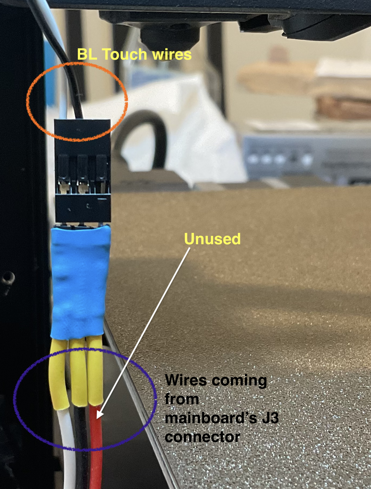

I am using Klipper as the firmware of my printer.

Look at [Klipper's documentation](https://www.klipper3d.org) and [this repository](https://github.com/KoenVanduffel/CR-6_Klipper) for instruction on how to set the firmware for CR-6.
My mainboard is _Creality 4.5.2_, other mainboards are going to have different pin names.

I found _Creality 4.5.2_'s pin names from [here](https://github.com/CR6Community/Marlin/blob/extui/Marlin/src/pins/stm32f1/pins_CREALITY_V45x.h) and [here](https://github.com/CR6Community/Marlin/blob/extui/Marlin/src/pins/stm32f1/pins_CREALITY_V452.h).


## Tools
These are the main tools and supplies **I** used, you don't need everything listed here to make this mod work. I'd say the bare minimum is having access to a 3-pin JST connector.

- [Crampign tool and JST/Dupoint connectors](https://www.amazon.com/dp/B0BJZN4KD7)
- [Wire Stripper](https://www.amazon.com/dp/B097SZ1F7W)
- [Heat shrink wraps](https://www.amazon.com/dp/B072PCQ2LW)
- [AWG24 Wires](https://www.amazon.com/dp/B089D13Y1N)
- [Soldering Iron](https://www.amazon.com/gp/product/B00ANZRT4M) and [solder](https://www.amazon.com/gp/product/B00068IJWC)
- [Multimeter](https://www.amazon.com/gp/product/B000EVYGZA)
- [BL Touch](https://www.amazon.com/dp/B076PQG1FF) (duh!)

1. Open the optical sensor and cut its wires as close to sensor as you can.

2. Using the following picture, extend the wires from the from the optical sensor's JST connector and connect it to the BL Touch servo wires: looking at the JST connector with its tab facing you
    - the left wire should be connected to BL Touch's *5V* (red wire)
    - the middle wire should be connected to BL Touch's *servo* (orange wire)
    - the right wire should be connected to BL Touch's *ground* (brown wire)

3. Connect 3 wires to a female JST XH-3Y pin. (I used red, black and white).
4. Open the mainboard's cover to access it, and conect the female JST connector to J3. In my case, the red wire is connected to top pin (3.3V) on J3, the black is connected to middle pin (ground) and the white is connected to bottom pin (signal). You will not use the red wire for BL Touch, I did it for future just in case if I ever needed a 3.3V line.

5. The other end of the wiret (from step 3) will be connected to BL Touch's probe signal:
    - Black wire from BL Touch to the ground pin of mainboard's J3 connector (in my case also black)
    - White wire from BL Touch to the signal pin of mainboard's J3 connector (in my case also white)
    - If like me, you also connected the 3.3V pin of mainboard's J3 connector to a wire, make sure it is fully insulated.
    

## Klipper config

The optical sensor was originally connected to `PC6` of MCU, and J3 connector's signal pin on mainboard is connected to `PA3` of MCU.
Therefore in your `printer.cfg` file of Klipper you need to have the following minimum setup:

```ini
[bltouch]
sensor_pin: PA3 # J3 connector's signal pin
control_pin: PC6 # Original optical sensor pin
```

Adjust the other options of `bltouch` section in `printer.cfg` file based on how you will mount the BL Touch to the X-carriage. You want to fully understand & follow the excellent guides in Klipper documentation for [Bed Leveling](https://www.klipper3d.org/Bed_Level.html) and [BL Touch setup](https://www.klipper3d.org/BLTouch.html).

I mounted mine using a combination of 3D printed part & some metallic parts I had from my monitor stand!

The CAD files I used in the above setup: [X-Carriage Mount](../resources/BLTouchCarriage-Mount.step) and [BL Touch Mount](../resources/BLTouchCarriage-Mount.step)

## Acknowledgement

[Q_not](https://www.reddit.com/user/Q_not/) was instrumental in [figuring out](https://www.reddit.com/r/CR6/comments/18s6fkv/comment/kf62rpf/?utm_source=share&utm_medium=web2x&context=3)
 the characteristics of *reserved* pins (J2/J3) on the mainboard.